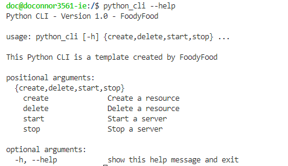
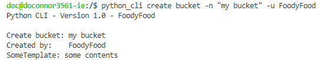
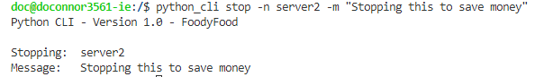

# Python CLI

This Python CLI template doesn't do very much, it just prints out text, but you can fill in the blanks and add to it.

The CLI, once built and installed, can be called form anywhere in the system to perform tasks. You can hook it into AWS CLI using subprocess.call. You could have it sort or write files. Have it bring up or down infrastructure to save money. And anything else you can do from a CLI, but want wrapped for simplicity, accessability, or to save time. 
<br>
<br>

## Example Screenshots

### Python CLI has a built in help command that lists all commands


<br>
<br>

### An example of using it to create some resource using a template


<br>
<br>

### Using it to stop a server


<br>
<br>


## Running Commands

For testing the commands you build, you can call them like this. This will save you rebuilding the WHL file each time to to test something

### Bash
```bash
python3 -m python_cli:main <args>
python3 -m python_cli:main start -n server1 -m "start reason"
```

### Windows
```
python -m python_cli:main <args>
python -m python_cli:main start -n server1 -m "start reason"
```
<br>
<br>


## Build And Install The WHL

You can build the CLI into a WHL file and install it to be called from anywhere on your system.

Building will require you to have setuptools and wheel isntalled

```bash
make build
make install
```

Once the WHL is installed you can call it directly from your CLI
(terminal or powershell)

```bash
python_cli start -n server1 -m "starting server to spend money"
python_cli stop -n server2 -m "stopping server to save money"
```
<br>
<br>


## List Of Commands

This is the complete list of commands available in the template
```
python_cli create server -u "FoodyFood"
python_cli create bucket -n "bucket-123"

python_cli start -n "server1" -m "I started this to spend money"
python_cli stop -n "server2" -m "I stopped this to save money"

python_cli delete server -u "FoodyFood"
python_cli delete bucket -n "bucket-456" -u "FoodyFood"
```
<br>
<br>


## Possible Issue

You may need to add your python site packages folder to your PATH variable

On Linux it would look like this
```bash
export PATH="$HOME/<username>/.local/bin:$PATH"
```
